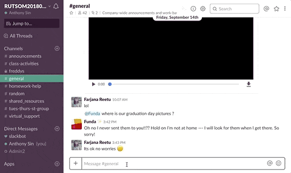
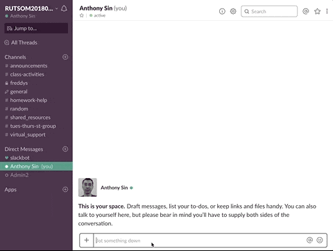
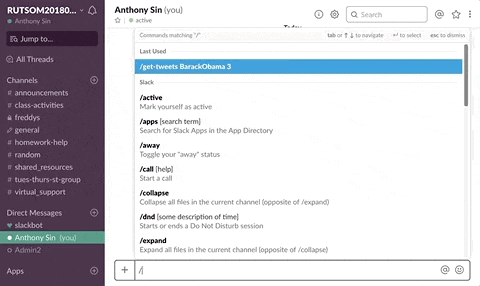

# slack-app-demo

*Assist the classroom Slack workspace with custom slash commands*

[Demo](#demo) 
[About](#about) 
[Technologies](#technologies)

## Demo

* `/select-student` - randomly select a student and ping selected student via direct message; accepts optional params for excluding users

  

* `/git-help` - quick git reference (useful for group projects); accepts optional params for sending to entire channel

  

* `/get-tweets` - get the latest tweets (1-5) of specified twitter user

  

## About

I created this app after my very awesome instructor, Franklin, from my Rutgers Coding Bootcamp program remarked in class how someday he would create a slack bot to pick students to answer his questions. Though it was an offhand comment, I decided to challenge myself one weekend and strive to build a slack app with this functionality.

After going through some Slack API documentation, following Slack tutorials here and there, doing some ngrok testing, and other trial and error adventures (and frustrations), I was finally able to get the `/select-student` slash command working! The `/get-tweets` command was also added as an exercise to show that third-party APIs could also be integrated with the Slack app. It was also quite simple to do, as I could port it over from my [Liri Node App](https://github.com/ats89/liri-node-app).

Finally, the `/git-help` command was later added as I was working on my third group project ([Instagarment](https://github.com/waywt/waywt)). It came in handy, as group members often asked about the git commands to work with the project. Now, they had a quick and easy reference!

The Slack app does not really have a frontend, as it operates as a node app (deployed [here](https://arcane-harbor-33194.herokuapp.com/) using Heroku) that accepts POST requests (the slash commands) from the Slack workspace. The functionality is shown in the demo section above.

## Technologies

* APIs ([Slack](https://api.slack.com), [Twitter](https://developer.twitter.com/en/docs.html)), Node.js, Express